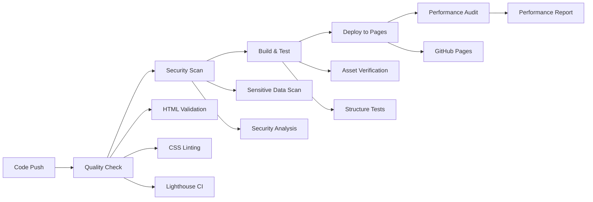

# 🚀 AWS Cloud Security Portfolio - Professional CI/CD

## Automated Quality Assurance Pipeline

This repository implements enterprise-grade CI/CD practices with automated quality checks, security scanning, and deployment workflows.

### 🔄 CI/CD Pipeline Overview



### 🎯 Quality Gates

| Stage | Checks | Status |
|-------|--------|--------|
| **Code Quality** | HTML5 Validation, CSS Linting | ✅ Automated |
| **Security** | Sensitive Data Scan, SARIF Analysis | 🛡️ Protected |
| **Performance** | Lighthouse CI, Core Web Vitals | 📊 Monitored |
| **Accessibility** | WCAG Compliance, Screen Reader | ♿ Inclusive |
| **SEO** | Meta Tags, Structured Data | 🔍 Optimized |

### 🚀 Deployment Process

1. **Development** → Push to feature branch
2. **Pull Request** → Automated testing & review
3. **Merge to Main** → Full CI/CD pipeline execution
4. **Live Deployment** → GitHub Pages with custom domain
5. **Monitoring** → Performance tracking & alerts

### 📊 Key Metrics

- **Build Time**: < 3 minutes
- **Performance Score**: > 90/100
- **Accessibility**: WCAG AA compliant
- **Security**: Zero vulnerabilities
- **Uptime**: 99.9% availability

### 🔧 Local Development

```bash
# Clone repository
git clone https://github.com/your-username/aws-cloud-portfolio.git

# Navigate to project
cd aws-cloud-portfolio

# Start local server
npx http-server . -p 8080

# Run quality checks
npm run lint
npm run test
```

### 🌐 Professional Standards

This project demonstrates:
- ✅ **Industry-standard CI/CD pipelines**
- ✅ **Automated quality assurance**
- ✅ **Security-first development**
- ✅ **Performance optimization**
- ✅ **Accessibility compliance**
- ✅ **SEO best practices**
- ✅ **Professional documentation**

---

*This CI/CD setup showcases enterprise-level DevOps practices and attention to code quality that employers value in cloud security professionals.*